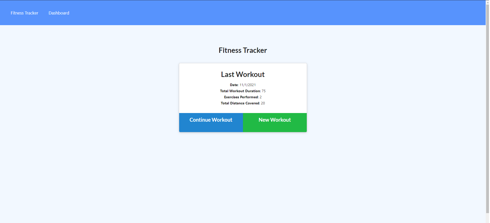
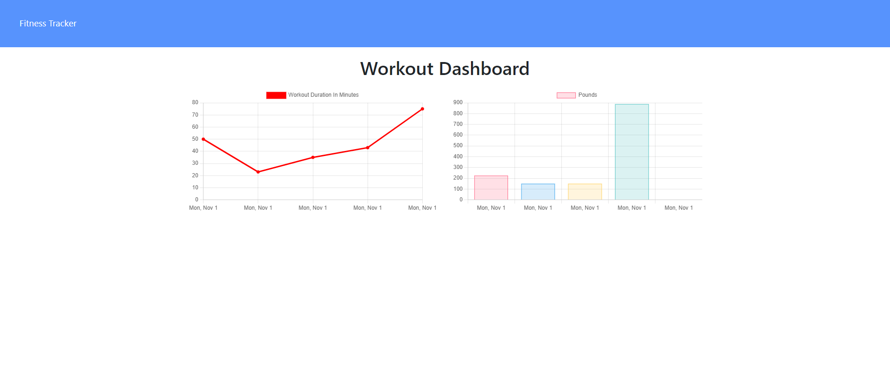

# Weekly-fitness-tracker

Deployed: https://shielded-river-35622.herokuapp.com/?id=6181683dd612f954bd6d20a5

Repo: https://github.com/curriecoder/weekly-fitness-tracker

## Description

This project was motivated by wanting to implement newly learned database languages (Mongoose) to create a back end capable of handling an existing front end. This application allows users to keep track of their workout routines and exercises while giving an "at a glance" view of the last 7 days of activity. During this project I learned how to apply Mongoose, Morgan, and general RESTful practices.

## Table of Contents (Optional)

- [Installation](#installation)
- [Usage](#usage)
- [Credits](#credits)
- [License](#license)

## Installation

To install this application, simply download the files and run `npm install` to install the required npm packages. Users can also just navigate to the deployed page to use the app online.

## Usage

To use this application, select 'New Workout' and enter an exercise. Users may then choose to input additional exercises until their workout is complete. Once the workout is done, click 'Complete' to add it to the dashboard page.
    
    
    
    
## Credits

Thanks to Phil Bohn for helping out on the home stretch of this project. A link to his GitHub: https://github.com/lamperouge1218.
As always, thank you to the great staff at the LPS Coding Bootcamp at UPenn.

## License

Copyright (2021) (Andrew Currie)

Permission is hereby granted, free of charge, to any person obtaining a copy of this software and associated documentation files (the "Software"), to deal in the Software without restriction, including without limitation the rights to use, copy, modify, merge, publish, distribute, sublicense, and/or sell copies of the Software, and to permit persons to whom the Software is furnished to do so, subject to the following conditions:

The above copyright notice and this permission notice shall be included in all copies or substantial portions of the Software.

THE SOFTWARE IS PROVIDED "AS IS", WITHOUT WARRANTY OF ANY KIND, EXPRESS OR IMPLIED, INCLUDING BUT NOT LIMITED TO THE WARRANTIES OF MERCHANTABILITY, FITNESS FOR A PARTICULAR PURPOSE AND NONINFRINGEMENT. IN NO EVENT SHALL THE AUTHORS OR COPYRIGHT HOLDERS BE LIABLE FOR ANY CLAIM, DAMAGES OR OTHER LIABILITY, WHETHER IN AN ACTION OF CONTRACT, TORT OR OTHERWISE, ARISING FROM, OUT OF OR IN CONNECTION WITH THE SOFTWARE OR THE USE OR OTHER DEALINGS IN THE SOFTWARE.
---